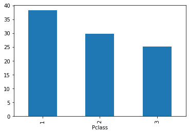
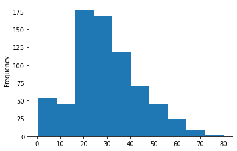
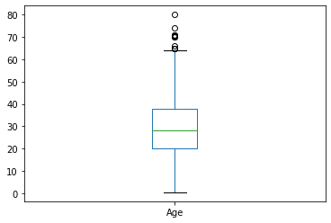

---
# try also 'default' to start simple
theme: seriph
download: true
# random image from a curated Unsplash collection by Anthony
# like them? see https://unsplash.com/collections/94734566/slidev
background: https://images.unsplash.com/photo-1604756904189-117de3259294?ixid=MnwxMjA3fDB8MHxwaG90by1wYWdlfHx8fGVufDB8fHx8&ixlib=rb-1.2.1&auto=format&fit=crop&w=1050&q=80
# apply any windi css classes to the current slide
class: 'text-center'
# default dark
colorSchema: 'auto'
# https://sli.dev/custom/highlighters.html
highlighter: shiki
# some information about the slides, markdown enabled
info: |
  ## Pandas Introduction
  Presentation slides for developers.

  MoF-DAC 2021 
---

# Pandas Introduction

Python for Data Analysis

<div class="pt-12">
  <span @click="$slidev.nav.next" class="px-2 p-1 rounded cursor-pointer" hover="bg-white bg-opacity-10">
    Press Space for next page <carbon:arrow-right class="inline"/>
  </span>
</div>

<a href="https://github.com/mofdac" target="_blank" alt="GitHub"
  class="abs-br m-6 text-xl icon-btn opacity-50 !border-none !hover:text-white">
  <carbon-logo-github />
</a>

<!--
The last comment block of each slide will be treated as slide notes. It will be visible and editable in Presenter Mode along with the slide. [Read more in the docs](https://sli.dev/guide/syntax.html#notes)
-->

---
layout: center
---

<h1 >Reza Rizky</h1>


<div class="my-10 grid grid-cols-[40px,1fr] w-min gap-y-4">
  <radix-icons-github-logo class="opacity-50"/>
  <div><a href="https://github.com/rezarzky" target="_blank">rezarzky</a></div>
  <radix-icons-twitter-logo class="opacity-50"/>
  <div><a href="https://twitter.com/rezarzky" target="_blank">rezarzky</a></div>
</div>

<!-- Intro 1 -->

---
layout: center
---

<h1 >Bakhtiar A.</h1>


<div class="my-10 grid grid-cols-[40px,1fr] w-min gap-y-4">
  <radix-icons-github-logo class="opacity-50"/>
  <div><a href="https://github.com/maziyank" target="_blank">maziyank</a></div>
  <radix-icons-twitter-logo class="opacity-50"/>
  <div><a href="https://twitter.com/maziyank" target="_blank">maziyank</a></div>
</div>

<!-- Intro 1 -->

---
layout: image-right
image: https://images.unsplash.com/photo-1546165215-eeea56db76c9?ixid=MnwxMjA3fDB8MHxwaG90by1wYWdlfHx8fGVufDB8fHx8&ixlib=rb-1.2.1&auto=format&fit=crop&w=1350&q=80
---

# Pandas ?

- Library yang menyediakan struktur data dan analisis data. 
- Digunakan untuk memanipulasi data, mengubah dimensi data, mengecek data, dan lain sebagainya. 
- Panda diambil dari istilah **"panel data"**, istilah ekonometrik untuk kumpulan data.
	
Versi terakhir 1.2.4 / 12 April 2021

Website: pandas.pydata.org

<!--
Pandas adalah sebuah library di Python yang menyediakan struktur data dan analisis data yang mudah digunakan. Pandas biasa digunakan untuk membuat tabel, mengubah dimensi data, mengecek data, dan lain sebagainya.
-->

---

# Topik 

- 📒 **Data Frame and Series** 
- 📃 **Reading Data** 
- 🔍 **Selecting and Filtering Data** 
- ⏬ **Sorting Data** 
- 📑 **Grouping Data** 
- 🧺 **Handling Missing Data** 
- 🪞 **Handling Duplicates** 
- 📝 **Apply Function** 
- 📊 **Brief Plotting** 
- 📥 **Saving Data** 

<br>
<br>

<!--
You can have `style` tag in markdown to override the style for the current page.
Learn more: https://sli.dev/guide/syntax#embedded-styles
-->

<style>
h1 {
  background-color: #2B90B6;
  background-image: linear-gradient(45deg, #4EC5D4 10%, #146b8c 20%);
  background-size: 100%;
  -webkit-background-clip: text;
  -moz-background-clip: text;
  -webkit-text-fill-color: transparent; 
  -moz-text-fill-color: transparent;
}
</style>

---
layout: image-right
image: https://images.unsplash.com/photo-1546165215-eeea56db76c9?ixid=MnwxMjA3fDB8MHxwaG90by1wYWdlfHx8fGVufDB8fHx8&ixlib=rb-1.2.1&auto=format&fit=crop&w=1350&q=80
---

# Menggunakan Pandas
<br/>
Secara default sudah tersedia di paket anaconda. Sehingga kita bisa langsung melakukan impor pustaka pandas.
<br/>
<br/>
<br/>

<v-click>

```py
import pandas as pd

# your code here ....
```
</v-click>

---
class: px-20
---

# Data Frame dan Series

<div grid="~ cols-1 gap-2" m="-t-2">

**DataFrame** adalah struktur data 2-dimensi yang berbentuk tabular (mempunyai baris dan kolom).
**Series** adalah struktur data 1-dimensi yang berbentuk tabular (mempunyai baris dan kolom).


</div>
---

# Data Frame Structure


---

# Data Frame Axis (1 atau 0 ?)
- **Axis 0** merepresentasikan rows dan **axis 1** merepresentasikan columns.
- Series hanya mempunyai 1 axis, axis 0.


---
layout: image-left
image: https://upload.wikimedia.org/wikipedia/en/1/19/Titanic_%28Official_Film_Poster%29.png
---

# Reading Data
|     |     |
| --- | --- |
| ```pd.read_csv()```| DataFrame dari file CSV |
| ```pd.read_excel()```| DataFrame dari file Excel |
| ```pd.read_html()```| DataFrame dari file HTML |

Contoh:
```py
import pandas

# membuat dataframe dari file titanic.csv
df = pd.read_csv('titanic.csv')
```
<br/>

Check out [the guides](https://pandas.pydata.org/pandas-docs/stable/reference/io.html) for more.

---

# Peek Data

Beberapa fungsi umum untuk melihat data secara sekilas:

<v-click>

```py {1-2|4-5|7-8|10-11|13-14|all}
# Membaca beberapa n baris pertama
df.head(n)

# Membaca beberapa n baris terakhir
df.tail(n)

# Membaca n baris data secara sampling
df.sample(n)

# Membaca n baris data terbesar sesuai kolom a
df.nlargest(a, n)

# Membaca n baris data terkecil sesuai kolom a
df.nsmallest(a, n)
```
</v-click>

---
layout: image-right
image: https://source.unsplash.com/collection/94734566/1920x1080
---

# Informasi Data Frame

Beberapa cara untuk mengetahui profil DataFrame

<!-- https://sli.dev/guide/syntax.html#line-highlighting -->

<v-click>

```py {1-2|4-5|7-8|10-11|13-14|16-17|all}
# mengetahui dimensi DataFrame
df.shape

# jumlah data (baris  x kolom) pada dataframe
df.size

# list kolom pada dataframe
df.columns

# list index pada dataframe
df.index

# informasi dataframe, kolom tipe data dsb.
df.info()

#informasi tipe data pada dataframe
df.dtypes

```

</v-click>

---

# Selecting Data 

Terdapat beberapa macam cara untuk mengeksplorasi data pada DataFrame

<v-click>

Mengakses data dengan nama kolom 
<!-- https://sli.dev/guide/syntax.html#line-highlighting -->

```py 
# mengakses satu kolom
df.nama_kolom
df["age"]

# mengakses lebih dari satu kolom
df[["sex", "age"]]
```

</v-click>

<v-click>

Memilih data dengan label tertentu dari posisi index (.iloc).
```py
  # memilih data pada baris ke 2 dan kolom ke 3
  df.iloc[1,2]

  # misal: memilih data pada baris ke 2 hingga ke 5 dan kolom ke 3 
  df.iloc[1:5, 2]

  # misal: memilih data pada seluruh baris ke untuk kolom ke 3 
  df.iloc[:, 2]
```

</v-click>

---

# Selecting Data

Terdapat beberapa macam cara untuk mengeksplorasi data pada DataFrame

Memilih data dengan nama index / kolom (.loc).
```py

  df.set_index("name", inplace = True)
  # memilih baris index ke-2 kolom ke-0

  df.loc["Allen, Mr. William Henry", "sex"]
  # memilih baris dengan nama index "Allen, Mr. William Henry" dan kolom "sex"

  df.loc["Allen, Mr. William Henry":"Graham, Miss. Margaret Edith", "fare":"class"]
  # memilih baris dengan index mulai dari "Allen, Mr. William Henry" 
  # sampai "Graham, Miss. Margaret Edith" dan kolom "fare" sampai "class"
```

Memilih single value data dengan nama index / kolom (.at).
```py
  df.at["Allen, Mr. William Henry", "sex"]
  # memilih baris dengan nama index "Allen, Mr. William Henry" dan kolom "sex"
```
---

# Filtering Data


Menggunakan conditional.
```py
  # memilih data berdasarkan kondisi tertentu
  df[boolean/conditional]

  # misal: memilih data dengan usia lebih dari 50
  df[df.age > 50]

  # misal: memilih data dengan usia lebih dari 50 dan kurang dari 70
  df[df.age > 50 & df.age < 79]   
```


Menggunakan query.
```py
  # memilih data berdasarkan kondisi tertentu
  df.query(expression)

  # misal: memilih data dengan usia lebih dari 50
  df.query("age > 50")

  # misal: memilih data dengan usia lebih dari 50 dan kurang dari 70
  df.query("age > 50 & age < 70")
```


---


# Sorting Data

Untuk melakukan sorting data pada DataFrame:

```py
df.sort_values(by, axis=0, ascending=True, inplace=False, 
kind='quicksort', na_position='last', ignore_index=False, key=None)
```

Contoh:

```py
# Hanya satu kolom:
dataframe.sort_values(by='age', ascending=False)

# Beberapa kolom:
df.sort_values(by=["age", "pclass"], ascending = (False, True))
```
See [the guides](https://pandas.pydata.org/pandas-docs/stable/reference/api/pandas.DataFrame.sort_values.html).

---

# Grouping Data

```py
df.groupby(by=None, axis=0, level=None, as_index=True, 
sort=True, group_keys=True, squeeze=<object object>, observed=False, dropna=True)
```
Contoh:

```py  
# Kelompokan berdasarkan embark_town
df_grouped = df.groupby(['embark_town']).mean()

# Aggregate functions: count(), mean(), sum(), min(), max(), median(), quantile(), var(), std()

# Melihat value pada group embark_town
df_grouped.get_group('embark_town')

```

See [the guides](https://pandas.pydata.org/pandas-docs/stable/reference/api/pandas.DataFrame.groupby.html).

---

# Handling Missing Value

```py
DataFrame.dropna(axis=0, how='any', thresh=None, subset=None, inplace=False)
DataFrame.fillna(value=None, method=None, axis=None, inplace=False, limit=None, downcast=None)

```
Contoh:

```py  
# Mengecek missing value
df.isnull()
# atau
df.isna()

# Menghapus missing value
df.dropna(inplace=True)

# Mengisi NaN value
df.age.fillna(value=df.age.mean(), inplace=True)

```

See [the guides](https://pandas.pydata.org/pandas-docs/stable/reference/api/pandas.DataFrame.dropna.html).

---


# Handling Duplicates

```py
df.drop_duplicates(subset=None, keep='first', inplace=False, ignore_index=False)
```
Contoh:

```py  
# Menghapus duplikat untuk seluruh kolom
df.drop_duplicates()

# Menghapus duplikat untuk spesifik kolom
df.drop_duplicates(subset=['name'], keep='last')

```

See [the guides](https://pandas.pydata.org/docs/reference/api/pandas.DataFrame.drop_duplicates.html).

---


# Apply Function 

Fungsi ini  dapat diaplikasikan ke DataFrame dan Series

```py
df.apply(func, axis=0, raw=False, result_type=None, args=(), **kwds)
```

Contoh:
```py
#using function
def makedouble(val):
  return val*2

df.fare.apply(makedouble)

#using lambda
df.fare.apply(lambda x: x*2)

```
See [the guides](https://pandas.pydata.org/pandas-docs/stable/reference/api/pandas.DataFrame.apply.html).

---

# Brief Plotting - Bar and Hist

Pandas terintegerasi dengan matplotlib sehingga kita bisa menggunakan secara langsung.

<div grid="~ cols-2 gap-2" m="-t-2">

```py
# Barplot
df_grouped = df.groupby(by="Pclass").mean()
df_grouped.Age.plot.bar()
```

```py
# Histogram
df.Age.plot.hist()
```





</div>

---

# Brief Plotting - Box and Scatter

Pandas terintegerasi dengan matplotlib sehingga kita bisa menggunakan secara langsung.

<div grid="~ cols-2 gap-2" m="-t-2">

```py
# Scatterplot
df.plot.scatter(x="Age", y="Fare")
```

```py
# Box Plot
df.Age.plot.box()
```




</div>

---
layout: center
class: 'text-center pb-5 :'
---

# Thank You!

Semoga bermanfaat.